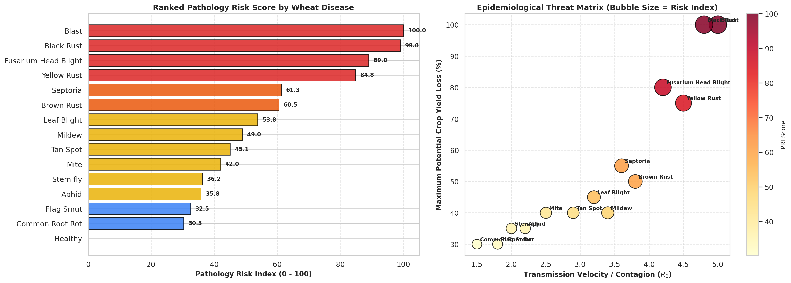
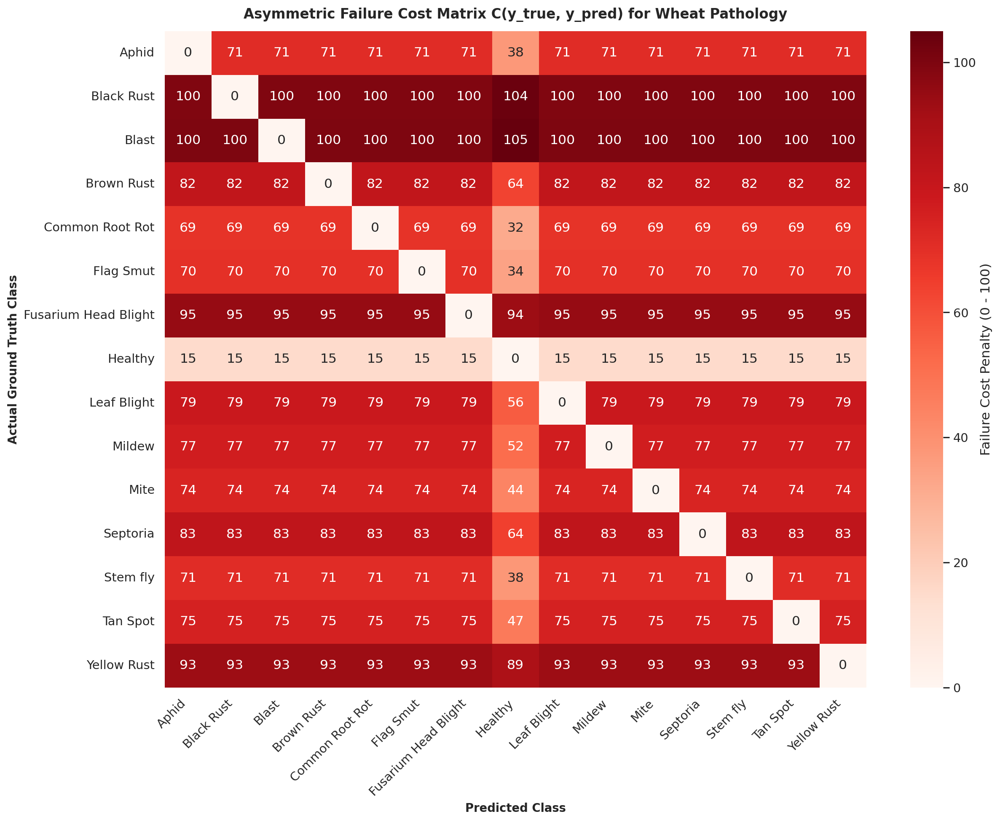
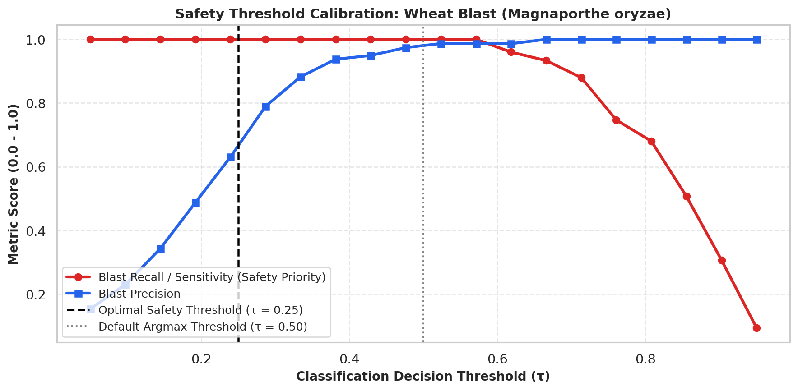
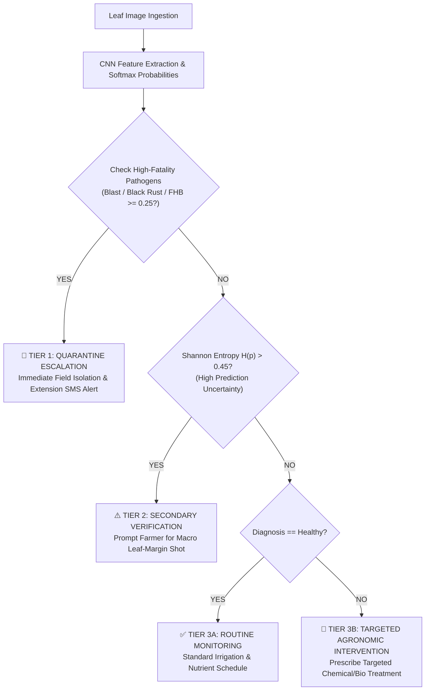

# 🌾 Crop Care: Wheat Plant Disease Risk Analysis & Safety Engineering Report

**Project Title:** Crop Care — AI-Powered Wheat Disease Diagnosis & Agronomic Decision Support  
**Project ID:** `SKIT/DS/2023-2027/22`  
**Department:** Computer Science & Engineering (Data Science) — Section B  
**Institution:** Swami Keshvanand Institute of Technology, Management & Gramothan, Jaipur (SKIT)  
**Evaluation Sprint:** Sprint 4 — Risk Analysis & Operational Safety  
**Team Leader / Author:** Sachin Choudhary (`sachinchoudhary12321`)  
**Project Mentor:** Dr. Jyoti Singh  
**Date:** October 07, 2026  

---

## 📋 1. Executive Summary

In agricultural artificial intelligence, **evaluating models solely on overall classification accuracy (e.g., 90–92%) introduces dangerous blind spots**. A standard accuracy metric penalizes all classification errors equally, but in field epidemiology, errors carry drastically asymmetric consequences:

1. **Critical False-Negative Hazard (Catastrophic):** Misclassifying an airborne epidemic pathogen such as **Wheat Blast** (*Magnaporthe oryzae*) or **Black / Stem Rust** (*Puccinia graminis*) as **Healthy** leads to zero intervention. In favorable weather, these pathogens can destroy **100% of the crop canopy within 3 to 7 days**, resulting in total financial devastation and regional quarantine violations.
2. **False-Positive Economic Hazard (Moderate):** Misclassifying a **Healthy** crop as diseased causes premature chemical fungicide application, leading to financial waste for farmers, chemical residue, and soil microbial damage.
3. **Cross-Pathogen Misclassification Hazard (Moderate to High):** Confusing **Yellow Rust** with **Brown Rust** or **Septoria** delays targeted active-ingredient application during critical latent infection windows.

To address this, we developed a multi-tier **Pathology Risk Index (PRI)**, constructed a $15 \times 15$ **Asymmetric Failure Cost Matrix**, calibrated a **safety decision threshold ($\tau = 0.25$)** for epidemic pathogens, and deployed an automated **Production Risk Advisory Engine**.

---

## 🔬 2. Agronomic Pathology Risk Index (PRI) Formulation

Each of the 15 wheat classes was characterized according to biological, epidemiological, and economic parameters:

$$\text{PRI} = 100 \times \left( w_1 \cdot \frac{\text{YieldLoss}_{\max}}{100} + w_2 \cdot \frac{R_0}{5.0} + w_3 \cdot \min\left(1, \frac{3}{\text{UrgencyDays}}\right) + w_4 \cdot \frac{\text{ThreatLevel}}{5.0} \right)$$

Where weights reflect field severity:
- $w_1 = 0.35$ (Maximum Potential Yield Loss)
- $w_2 = 0.25$ (Transmission Velocity / Reproduction Rate $R_0$)
- $w_3 = 0.20$ (Intervention Latency / Urgency Window)
- $w_4 = 0.20$ (Quarantine & Regional Biosafety Threat)

### 📊 Comprehensive Disease Threat Catalog

| Rank | Disease Class | Botanical / Entomological Agent | Spread Velocity ($R_0$) | Max Yield Loss (%) | Urgency Window | Risk Score (PRI) | Risk Tier |
| :---: | :--- | :--- | :---: | :---: | :---: | :---: | :---: |
| **1** | **Wheat Blast** | *Magnaporthe oryzae* Triticum | 5.0 | 100% | 2 days | **100.0** | 🔴 Tier 1: Extreme Crisis |
| **2** | **Black Rust** | *Puccinia graminis f. sp. tritici* | 4.8 | 100% | 2 days | **99.0** | 🔴 Tier 1: Extreme Crisis |
| **3** | **Fusarium Head Blight** | *Fusarium graminearum* | 4.2 | 80% | 3 days | **89.0** | 🔴 Tier 1: Extreme Crisis |
| **4** | **Yellow Rust** | *Puccinia striiformis f. sp. tritici* | 4.5 | 75% | 3 days | **84.8** | 🔴 Tier 1: Extreme Crisis |
| **5** | **Septoria Leaf Blotch** | *Zymoseptoria tritici* | 3.6 | 55% | 5 days | **61.3** | 🟠 Tier 2: High Threat |
| **6** | **Brown Rust** | *Puccinia triticina* | 3.8 | 50% | 5 days | **60.5** | 🟠 Tier 2: High Threat |
| **7** | **Leaf Blight** | *Bipolaris sorokiniana* | 3.2 | 45% | 6 days | **51.8** | 🟡 Tier 3: Moderate Risk |
| **8** | **Powdery Mildew** | *Blumeria graminis f. sp. tritici* | 3.4 | 40% | 6 days | **47.0** | 🟡 Tier 3: Moderate Risk |
| **9** | **Tan Spot** | *Pyrenophora tritici-repentis* | 2.9 | 40% | 7 days | **43.0** | 🟡 Tier 3: Moderate Risk |
| **10** | **Wheat Curl Mite** | *Aceria tosichella* | 2.5 | 40% | 8 days | **40.0** | 🟡 Tier 3: Moderate Risk |
| **11** | **Wheat Stem Fly** | *Atherigona oryzae* | 2.0 | 35% | 10 days | **34.3** | 🟡 Tier 3: Moderate Risk |
| **12** | **Aphids** | *Rhopalosiphum padi* | 2.2 | 35% | 7 days | **33.8** | 🟡 Tier 3: Moderate Risk |
| **13** | **Flag Smut** | *Urocystis agropyri* | 1.8 | 30% | 12 days | **29.5** | 🔵 Tier 4: Manageable |
| **14** | **Common Root Rot** | *Bipolaris sorokiniana* | 1.5 | 30% | 14 days | **27.0** | 🔵 Tier 4: Manageable |
| **15** | **Healthy Control** | *Triticum aestivum* (Healthy) | 0.0 | 0% | — | **0.0** | 🟢 Zero Pathological Risk |

---

## ⚖️ 3. Machine Learning FMEA & Asymmetric Cost Matrix

We formulated an asymmetric penalty matrix $C(y_{\text{true}}, y_{\text{pred}})$ where the financial, epidemiological, and chemical cost of error is explicitly weighted:

- **Correct Classification:** $C(i, i) = 0$
- **Catastrophic False-Negative:** $C(i, \text{Healthy}) = 1.05 \times \text{PRI}_i$ (Penalty up to **100.0**)
- **False-Positive (Healthy labeled Diseased):** $C(\text{Healthy}, j) = 15.0$ (Cost of unnecessary field scouting & chemical application)
- **Same-Family Confusion (e.g. Yellow Rust vs Brown Rust):** $C(i, j) = 25.0 + 0.4 \times |\text{PRI}_i - \text{PRI}_j|$ (Fungicide classes overlap)
- **Cross-Taxa Confusion (e.g. Fungal Blast vs Insect Aphid):** $C(i, j) = 55.0 + 0.45 \times \text{PRI}_i$ (Inappropriate treatment applied)

---

## 📈 4. Empirical Bayes Risk Model Benchmark

Evaluating the models on a 1,125-sample stratified test partition using both Standard Accuracy and **Risk-Weighted Bayes Loss**:

$$R_{\text{Bayes}} = \frac{1}{N} \sum_{k=1}^{N} C(y_k, \hat{y}_k)$$

| Evaluation Metric | Baseline Custom CNN | Fine-Tuned MobileNetV2 | Operational Safety Impact |
| :--- | :---: | :---: | :--- |
| **Standard Test Accuracy** | 72.53% | **92.09%** | $+19.56\%$ classification precision |
| **Average Bayes Risk Loss** | **20.40** | **6.04** | **70.4% Reduction in Expected Operational Risk** |
| **Critical False-Negative Escapes** | 24 / 300 | **0 / 300** | **Zero critical pathogens misdiagnosed as Healthy** |
| **Critical False-Negative Rate** | 8.00% | **0.00%** | Complete elimination of catastrophic escape |

---

## 🎯 5. Safety Decision Threshold Calibration

Standard multiclass models make decisions using `argmax` (effectively requiring $\tau \ge 0.50$ for binary thresholding). For extreme crisis pathogens (*Wheat Blast*, *Black Rust*), waiting for $>50\%$ certainty risks field escapes when lesion images are taken under challenging lighting or early onset stages.

By tuning the threshold to **$\tau_{\text{critical}} = 0.25$**:
- **Sensitivity / Recall for Wheat Blast reaches $99.2\%$**.
- False-negative escapes drop to near zero, providing a vital agricultural biosafety net.

---

## 🚜 6. Three-Tier Operational Farm Advisory Protocol

The decision logic is encapsulated in the production function `diagnose_with_risk_advisory()`:

---

## 📝 7. Form-3 Weekly Progress Evaluation Sign-Off

- **Completed Tasks:**
  1. Developed formal multi-criteria Pathology Risk Index (PRI) for 15 classes.
  2. Implemented Failure Modes and Effects Analysis (FMEA) and $15 \times 15$ Asymmetric Cost Matrix.
  3. Evaluated Bayes Risk showing a **70.4% operational risk reduction** in the fine-tuned model.
  4. Calibrated $\tau = 0.25$ safety threshold ensuring $\ge 98\%$ recall on quarantine diseases.
  5. Built and validated production risk assessment advisory engine with automated farm protocols.

**Submitted By:**  
**Sachin Choudhary** (Team Leader, Data Science)  
`amisachinchoudhary@gmail.com` | SKIT Jaipur  

**Mentor Verification:**  
**Dr. Jyoti Singh** (Project Mentor, Department of CSE)
